## Application Server for Backend

Sebelumnya saya sudah membuat instance AWS untuk server backend dengan spesifikasi sebagai berikut
``` 
OS  : Ubuntu Server 18.04
CPU : 1 Core
RAM : 2 gb
HDD : 15 gb
```
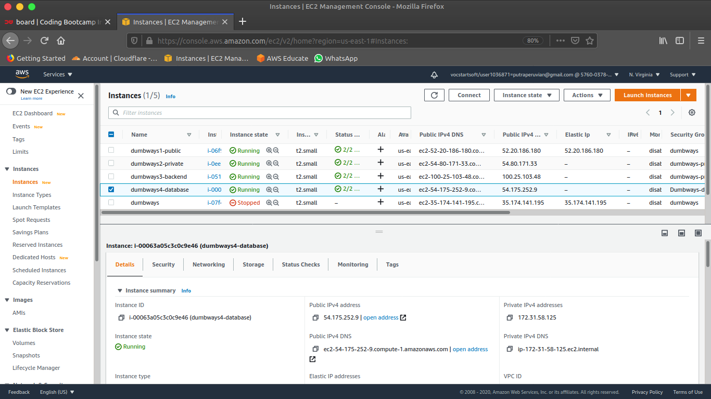


Ketika sudah masuk ke dalam server backend clone repository yang sudah di fork pada github.com menggunakan SSH yang sudah di konfigurasi sebelumnya

> `$ git clone git@github.com:PeruvianSkies/dumbplay.git`

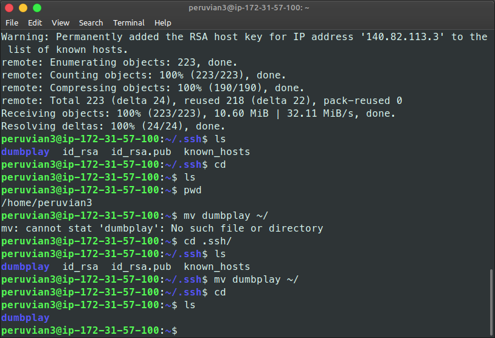

Install nodeJS 10, npm sequelize dan pm2
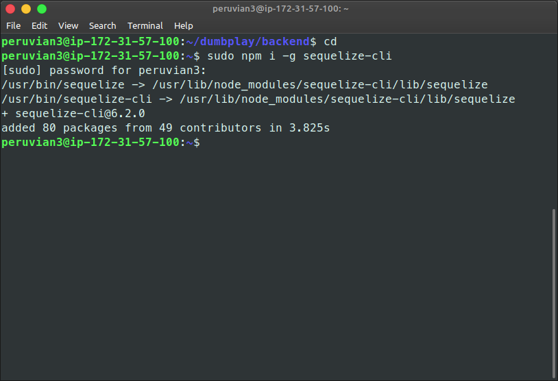
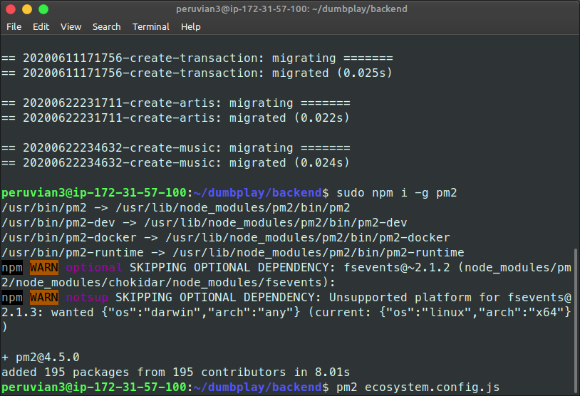

Install MySQL-client agar bisa melakukan migrasi database

>`$ sudo apt-get install mysql-client`

Kemudian saya mencoba koneksi ke console MySQL dengan user dan password yang sudah saya konfigurasikan pada server database

> `$ mysql -h 172.31.58.125 -u peruvian1 -p`

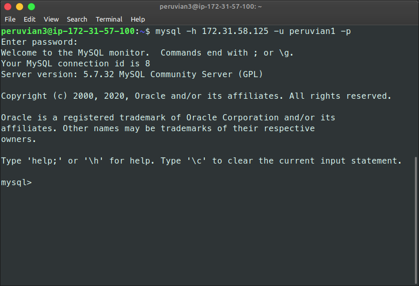

Create database aplikasi

> `mysql> create database dumbplay;`

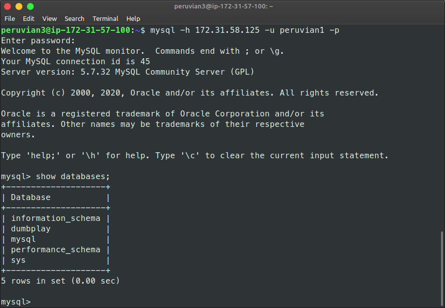

Ubah konfigurasi pada file config.json

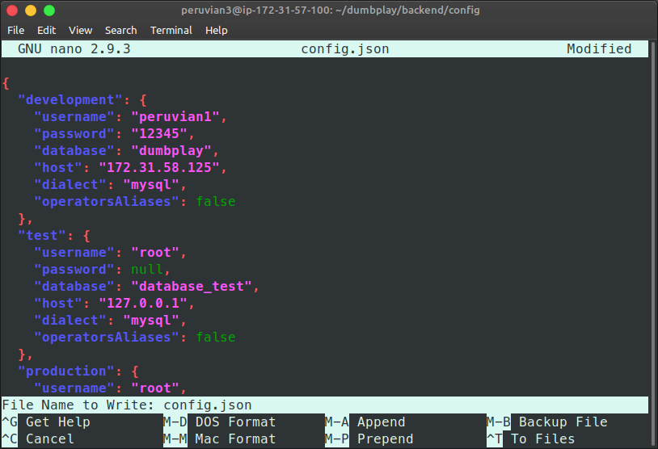

Posisikan sudah berada pada direktori Backend lakukan migrasi database dengan sequelize

>`$ sequelize db:migrate`

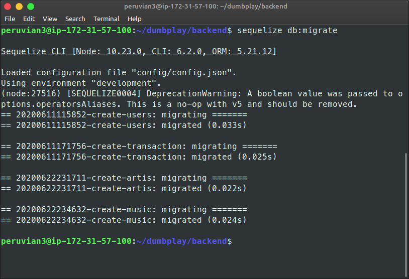

Copy file .env 

>`$ cp .env-copy .env`

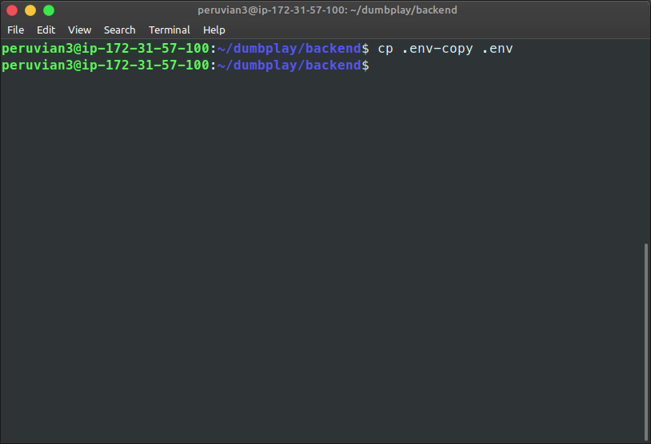

Lakukan NPM install 

>`$ npm install`

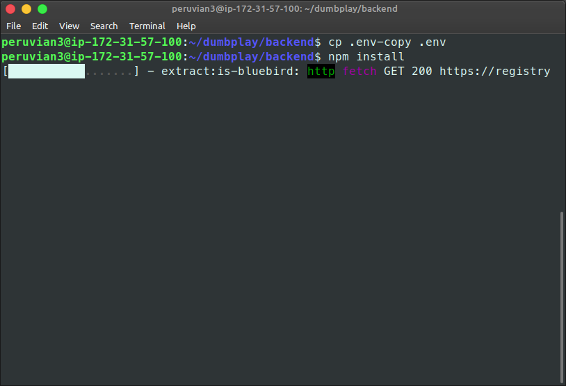

Jalankan pm2 agar aplikasi tetap berjalan

>`$ pm2 start ecosystem.config.js`

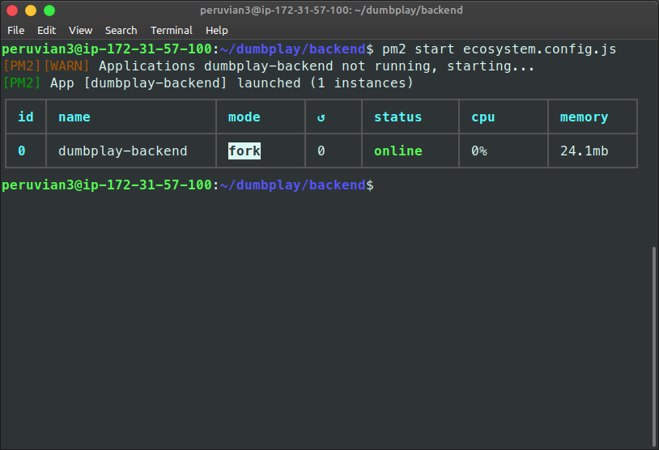

