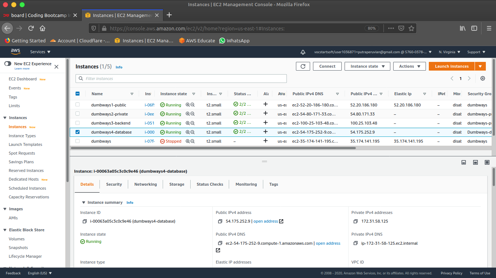
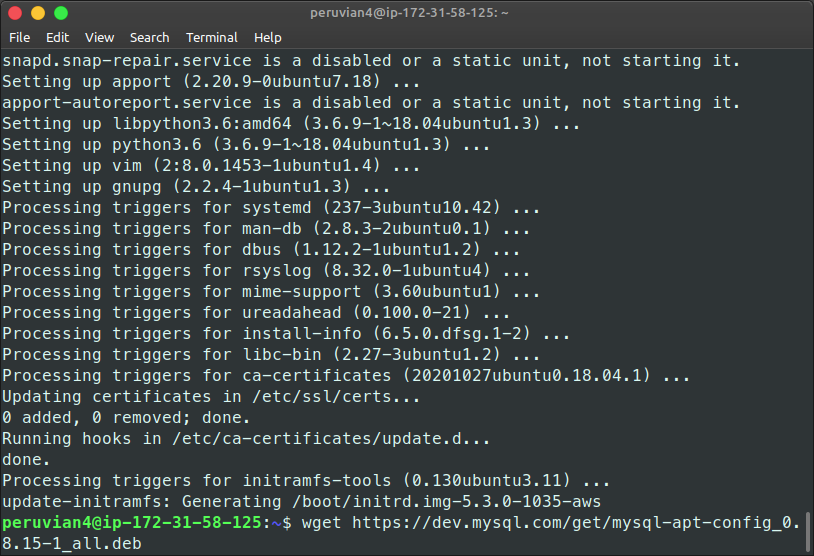
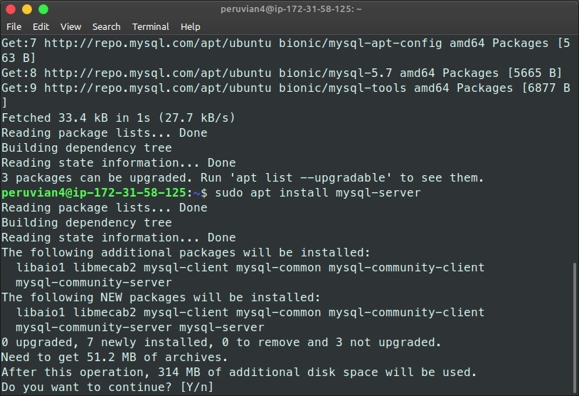
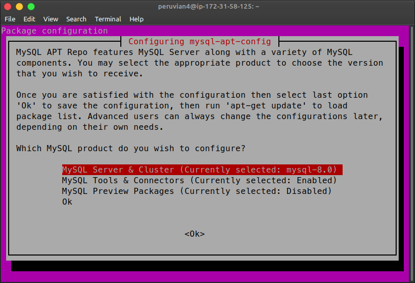
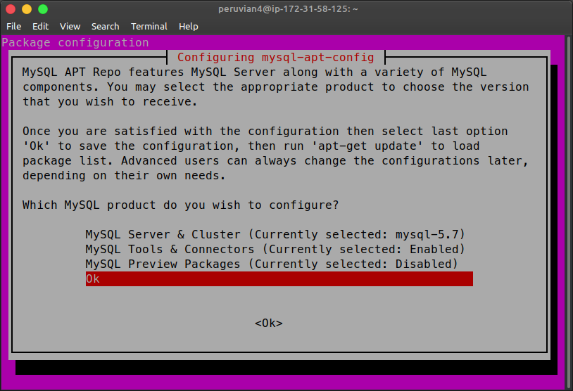
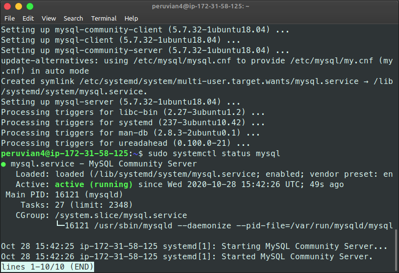
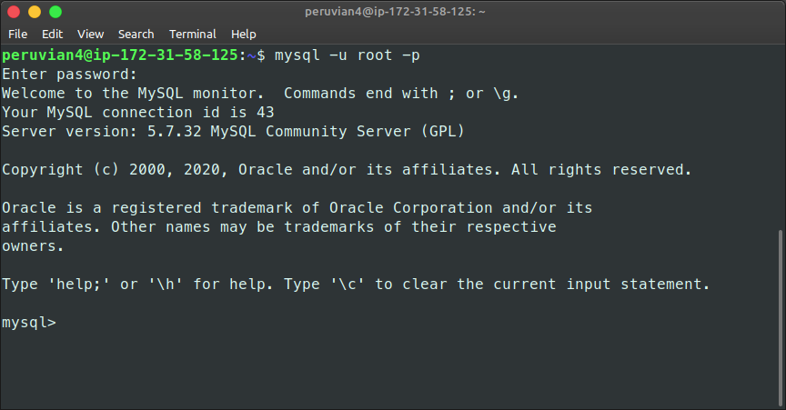
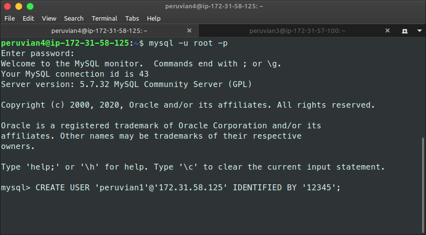
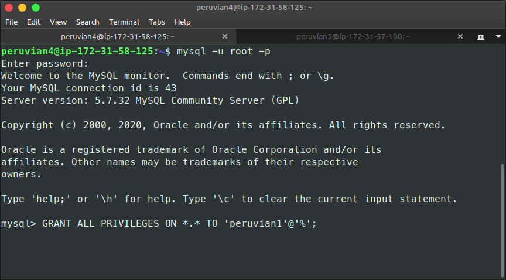
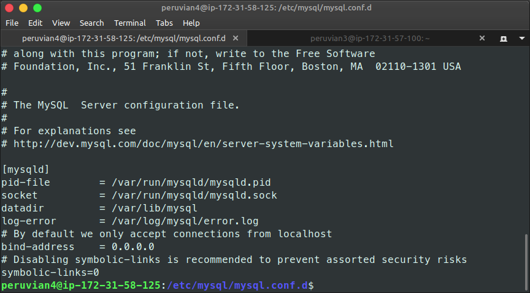

## Datase MYsql

Sebelumnya saya sudah membuat instance AWS untuk server database dengan spesifikasi sebagai berikut
``` 
OS  : Ubuntu Server 18.04
CPU : 1 Core
RAM : 2 gb
HDD : 15 gb
```


### Install MySQL
Buka web MySQL Community kemudian copy link download dan gunakan perintah `wget` pada Terminal
> `$ wget https://dev.mysql.com/get/mysql-apt-config_0.8.15-1_all.deb`



Ekstrak package yang sudah terdownload
> `$ sudo dpkg -i mysql-apt-config_0.8.15-1_all.deb`

Kemudian Install package tersebut
> `$ sudo apt install mysql-server`



Ketika proses instalasi berjalan maka pop up `mysql-apt-config` akan muncul
(Disini saya menggunakan mysql server 5.7)




Jika proses installasi telah selesai cek status mysql
> `$ sudo systemctl status mysql`



Masuk ke MySQL dengan user root yang sudah di buat pada saat installasi
> `$ mysql -u root -p`



Buat user baru untuk mengakses pada MySQL pada server backend, tambahkan juga password dan IP server database
> `mysql> CREATE USER 'peruvian1'@'172.31.58.125' IDENTIFIED BY '12345'`



Berikan permission root pada user baru yang sudah di buat

> `mysql> GRANT ALL PRIVILEGES ON *.* TO 'peruvian1'@'%'`



Kemudian edit file konfigurasi MySQL dan ubah **bind-address** ke 0.0.0.0 agar bisa di akses dari server backend, save file kemudian restart service MySQL
> `$ cd /etc/mysql/mysql.conf.d`

> `$ sudo nano mysqld.cnf`

> `$ sudo systemctl restart mysql`



