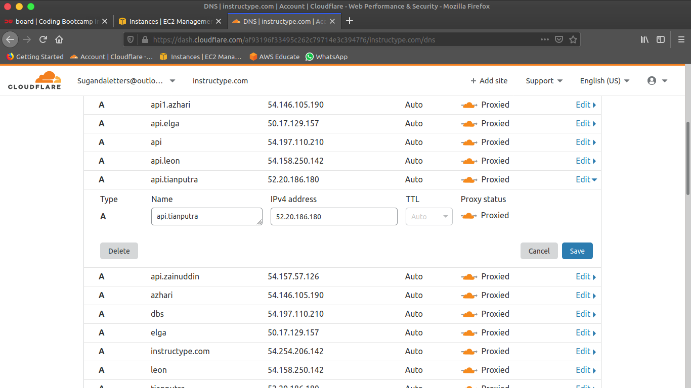

## Reverse Proxy

Buka cloudflare.com dan tambahkan ip server backend

Kembali ke server 1 untuk mengkonfigurasi proxy,
buat file .config baru di dalam direktori yang sama dengan file .config pada server frontend.
Untuk `server_name` arahkan ke domain api yang sudah dibuat sebelumnya, dan arahkan `proxy_pass` ke IP server backend dengan port `:5000`

Buka browser untuk cek konektifitas

## SSL Configuration

Sebelumnya saya ubah terlebih dahulu mode **Proxied** menjadi mode **DNS only** pada cloudflare
Kemudian copy Global API Key pada menu profile

Kembali ke terminal server public untuk konfigurasi

Buat folder .secrets dan isikan folder tersebut dengan file cloudflare.ini untuk menyimpan Api key

Posisikan pada user **root**

>`$ sudo su`

>`# mkdir /root/.secrets`

>`# nano /root/.secrets/cloudflare.ini`

Isikan file tersebut dengan format berikut

dns_cloudflare_email = "putraasdasdasd@gmail.com"
dns_cloudflare_api_key = "global-apikey"

Berikan permission pada folder dan file tersebut agar hanya bisa diakses oleh **root**

>`$ sudo chmod 0700 /root/.secrets`

>`$ sudo chmod 0400 /root/.secrets/cloudflare.ini`

Terapkan SSL dengan perintah certbot

>`$ sudo certbot certonly --dns-cloudflare --dns-cloudflare-credentials /root/.secrets/cloudflare.ini -d tianputra.instructype.com,*.tianputra.instructype.com --preferred-challenges dns-01`

Edit file reverse proxy untuk server backend
Hapus pada bagian `listen [::]:443 ssl ipv6only=on;`

>`$ sudo nano /etc/nginx/dumbways/dumbplay.conf`

Restart Nginx

>`$ sudo systemctl restart nginx.service`

***
***

Masuk server frontend untuk edit file `api.js`

>`$ sudo nano dumbplay/frontend/src/config/api.js`

Arahkan **baseURL** ke domain api dan tambahkan dengan `/api/v1`

Restart pm2.

>`$ pm2 restart 0`

Sebelumnya saya sudah melakukan tes menggunakan aplikasi **Postman**

Berikut tampilan login pada browser

SSL certificate untuk domain api

