## SSH & Git

Ketika proses pembuatan instance selesai, kemudian kembali ke terminal untuk membuat **SSH-key**
   > `$ ssh-keygen -C "peruvian3@aws"`

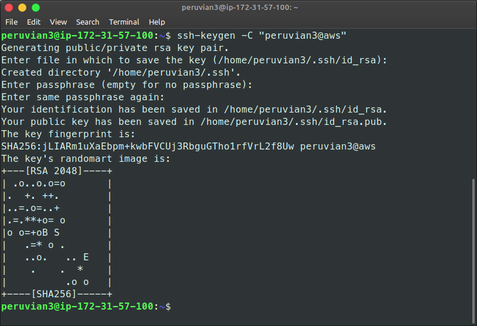

Kemudian masuk ke direktori .ssh
   > `$ cd .ssh/`

Copy isi file id_rsa.pub
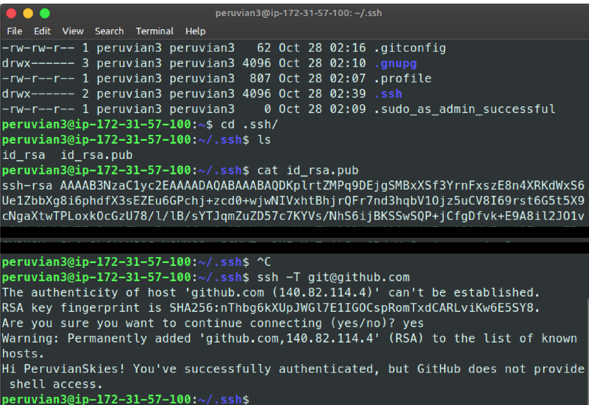

Buka github.com masuk setting dan klik **SSH-Key**
New SSH-Key kemudian masukkan paste isi file id_rsa.pub
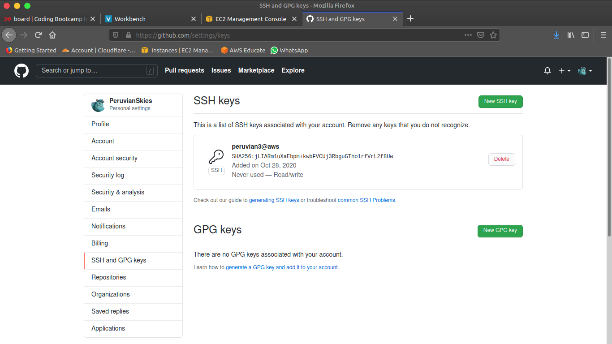

Kembali ke terminal untuk cek konektivitas akun Github

> `$ ssh -T git@github.com`

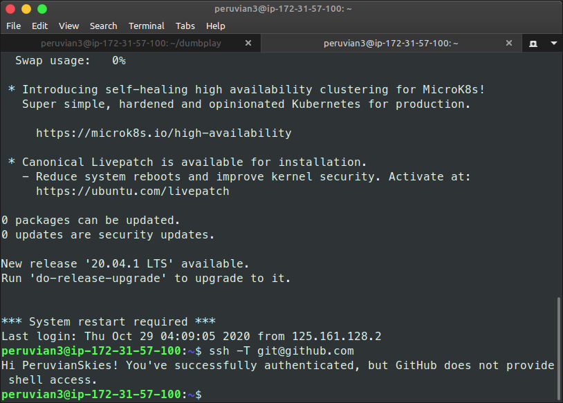

Jika sudah terkoneksi buka github repository sgnd untuk fork aplikasi
Tunggu sampai proses fork ke repository pribadi berhasil

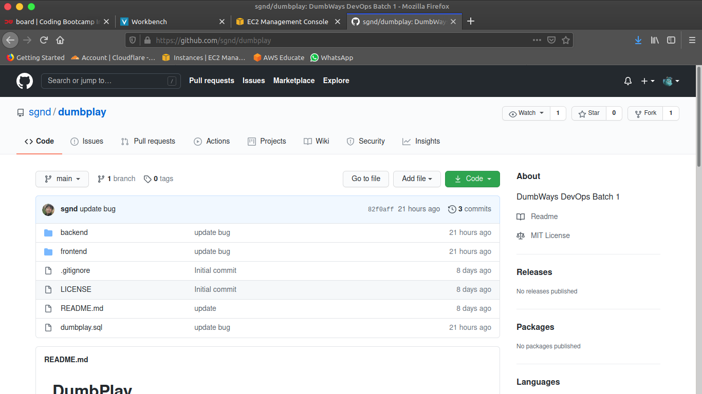
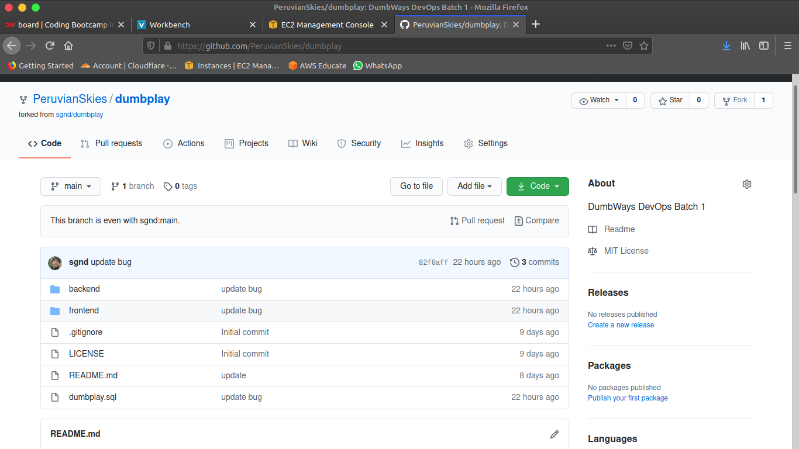

Kembali lagi ke terminal untuk melakukan clone repo

> `$ git clone git@github.com:PeruvianSkies/dumbplay.git`

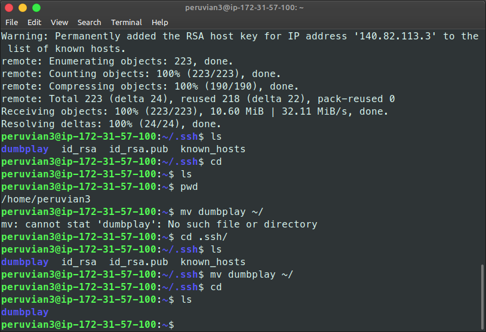

Membuat sedikit perubahan pada file README.md

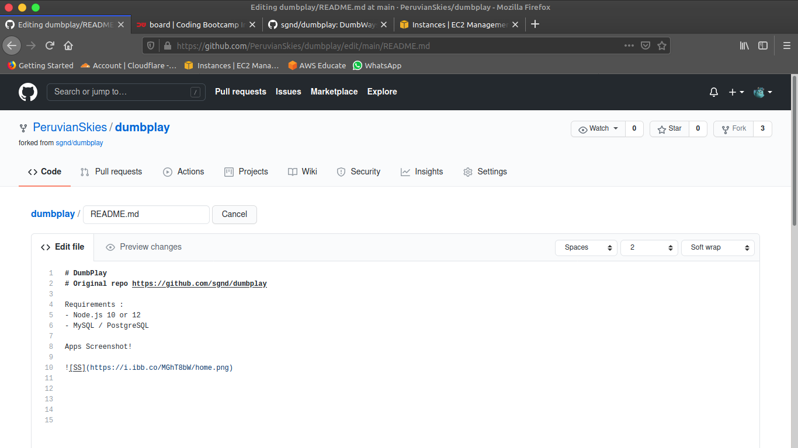

Kembali ke Terminal untuk melakukkan pull

> `$ git pull`

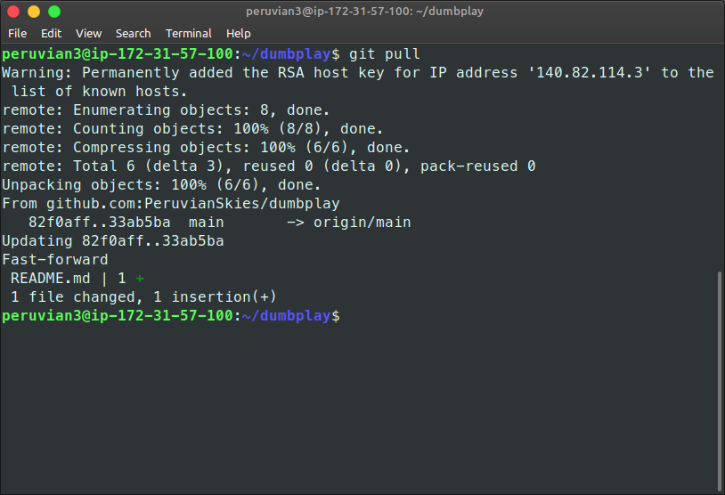

Membuat sedikit perubahan kembali pada file README.md

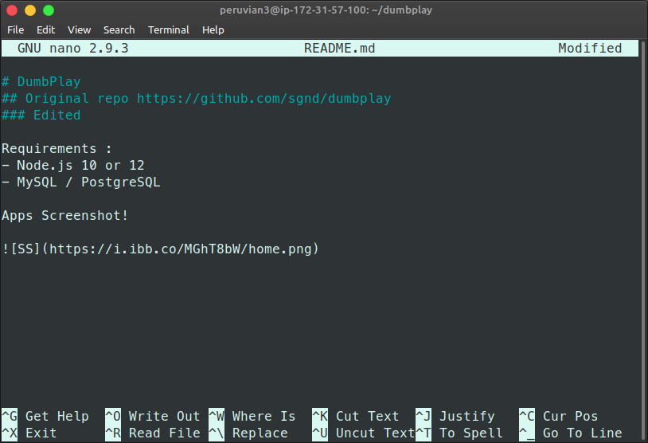

Kemudian saya lakukan commit repo

> `$ git add .`

> `$ git commit -m "edited file"`

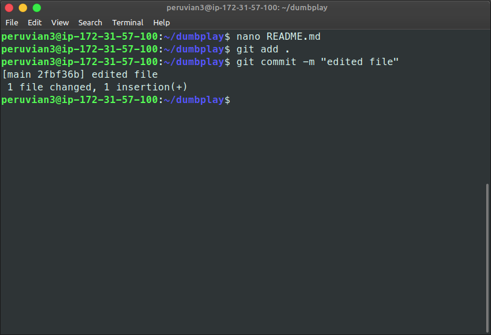

Kemudian saya lakukan push repo

> `$ git push`

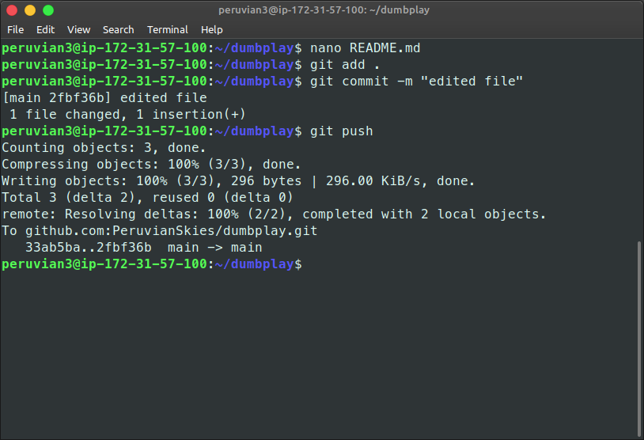